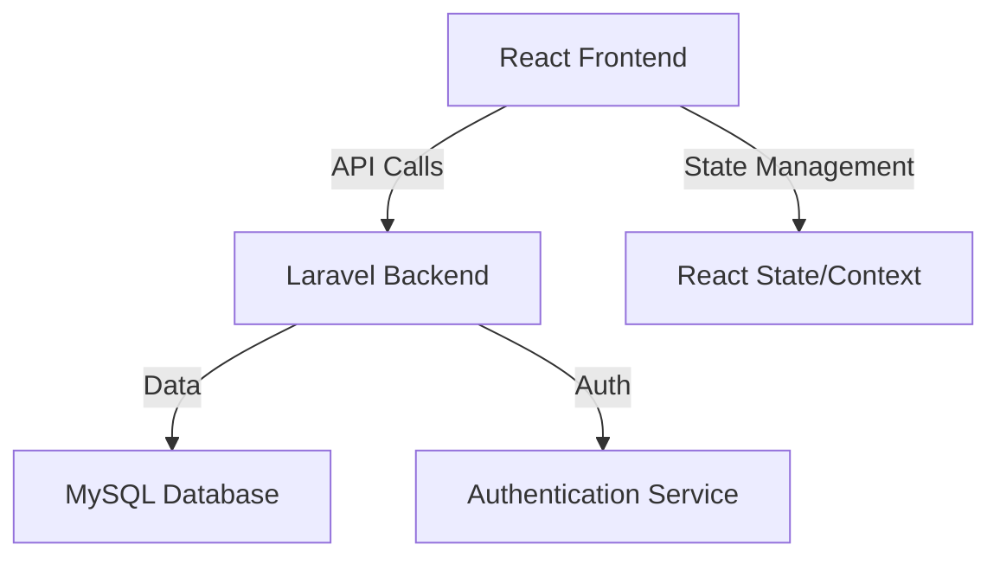

# System Patterns

## Architecture Overview

## Design Patterns

### Frontend Patterns
1. Component-Based Architecture
   - Reusable UI components
   - Container/Presenter pattern
   - Custom hooks for logic reuse

2. State Management
   - React Context for global state
   - Local state for component-specific data
   - Custom hooks for state logic

3. Routing
   - React Router for navigation
   - Protected routes for authenticated sections
   - Lazy loading for performance

### Backend Patterns
1. MVC Architecture
   - Models for data structure
   - Controllers for business logic
   - Resources for API responses

2. Repository Pattern
   - Data access abstraction
   - Business logic separation
   - Query optimization

3. Service Layer
   - Business logic encapsulation
   - Transaction management
   - Cross-cutting concerns

## API Design
1. RESTful Endpoints
   - Resource-based URLs
   - HTTP method semantics
   - Status code usage

2. Authentication
   - Token-based auth
   - Role-based access control
   - Session management

3. Response Format
   - Consistent JSON structure
   - Error handling
   - Pagination

## Database Patterns
1. Schema Design
   - Normalized structure
   - Relationship management
   - Index optimization

2. Query Patterns
   - Eager loading
   - Query optimization
   - Transaction management

## Security Patterns
1. Authentication
   - Token-based auth
   - Password hashing
   - Session management

2. Authorization
   - Role-based access
   - Permission checking
   - Resource protection

3. Data Protection
   - Input validation
   - XSS prevention
   - CSRF protection 